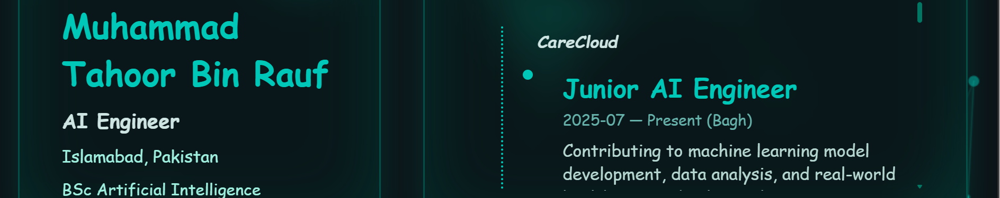

# Muhammad Tahoor Bin Rauf – AI Engineer Portfolio

Welcome to my personal **AI-driven portfolio** built with **Next.js**, **React**, and **TypeScript**.
This website highlights my journey as an AI Engineer, showcasing my **experience**, **projects**, **skills**, **certifications**, and a unique **interactive chatbot** that demonstrates my work with AI-powered user experiences.

🔗 **Live Demo:** [https://tahoor.vercel.app/](https://tahoor.vercel.app/)

---

## ✨ Features

* **Responsive Design** – A fully responsive layout that adapts seamlessly to desktops, tablets, and mobile devices.
* **Modern UI/UX** – Inspired by **Glassmorphism**, with blurred backgrounds, translucent cards, and subtle shadows for a sleek aesthetic.
* **Custom Fonts & Styling** – Leveraging Google Fonts (**Bebas Neue**) for bold headings combined with **styled-components** for modular styling.
* **Interactive Sections** – Structured sections for *About Me, Experience, Projects, Skills,* and *Certifications* with engaging animations and transitions.
* **AI Chatbot** – Integrated chatbot powered by API routes, enabling conversational interactions directly within the portfolio.
* **Dynamic Content** – Data-driven approach using structured JSON files for projects, skills, and experiences, making the portfolio easy to update and scale.
* **Social Links Hub** – Quick access to my **Email, LinkedIn, GitHub, and Upwork** profiles, ensuring easy networking opportunities.
* **Optimized Performance** – Built with **Next.js App Router**, ensuring lightning-fast load times and excellent SEO.
* **Deployment Automation** – Seamless integration with **Vercel** for continuous deployment on every push to the repository.

---

## 🛠️ Technologies Used

* **Frameworks & Libraries**: Next.js 13+, React 18+, TypeScript
* **Styling**: styled-components, CSS Modules, Google Fonts
* **UI Enhancements**: react-icons, particle background effects
* **AI Integration**: API routes with chatbot integration for interactive functionality
* **Version Control**: Git + GitHub
* **Deployment**: Vercel (CI/CD enabled with auto-deploys)

---

## 📂 Project Structure

The portfolio is organized for scalability and clarity:

```
.
├── .env.local
├── .gitignore
├── README.md
├── app
│   ├── api
│   │   └── chat
│   │       └── route.ts
│   ├── components
│   │   ├── aboutMe.tsx
│   │   ├── backgroundParticles.tsx
│   │   ├── certs.tsx
│   │   ├── chatbot.tsx
│   │   ├── experience.tsx
│   │   ├── portfolioLayout.tsx
│   │   ├── projects.tsx
│   │   └── skills.tsx
│   ├── data
│   │   ├── aboutMe.json
│   │   ├── certs.json
│   │   ├── experience.json
│   │   ├── projects.json
│   │   └── skills.json
│   ├── favicon.ico
│   ├── globals.css
│   ├── layout.tsx
│   ├── page.module.css
│   ├── page.tsx
│   └── styles
├── eslint.config.mjs
├── next-env.d.ts
├── next.config.js
├── next.config.ts
├── package-lock.json
├── package.json
├── print_tree.py
├── public
│   ├── file.svg
│   ├── globe.svg
│   ├── images
│   │   ├── ai-ta.jpg
│   │   ├── alzheimer.png
│   │   ├── bias-mitigation.png
│   │   ├── consumer-behaviour.jpg
│   │   ├── floorplans.jpg
│   │   └── usda-nlp.png
│   ├── next.svg
│   ├── vercel.svg
│   └── window.svg
└── tsconfig.json
```

This modular structure ensures that adding new projects, experiences, or skills requires **only updating JSON files**, keeping content separate from presentation.

---

## 🚀 Installation & Running Locally

1. **Clone the repository**

```bash
git clone <https://github.com/TahoorBR/portfolio>
cd <your-project-folder>
```

2. **Install dependencies**

```bash
npm install
```

3. **Run the development server**

```bash
npm run dev
```

4. **Open in your browser**

Visit [http://localhost:3000](http://localhost:3000) to explore the portfolio locally.

---

## 🌐 Deployment

The portfolio is deployed using **Vercel**, enabling instant previews and production deployments.

* Any commit pushed to the `main` branch triggers an **automatic deployment**.
* Vercel provides analytics, domain management, and serverless API support for the chatbot.

🔗 Live Deployment: [https://tahoor.vercel.app/](https://tahoor.vercel.app/)

---

## 📌 How to Contribute / Customize

If you'd like to adapt this portfolio for your own use:

1. Fork the repository.
2. Replace JSON content inside `/app/data/` with your own details (About Me, Skills, Projects).
3. Update images inside `/public/images/`.
4. Customize colors, fonts, and animations in `globals.css` or `styled-components`.

This approach allows others to use the portfolio as a **template** while personalizing it for their own professional brand.

---

## 📸 Preview


```

---

## 📖 Future Enhancements

* Add **dark/light mode toggle** for accessibility.
* Expand chatbot to integrate with **OpenAI API** for smarter, contextual answers.
* Add a **blog section** for writing about AI, research, and projects.
* Incorporate **downloadable resume** functionality directly on the site.
* Integrate **Google Analytics** for traffic insights.

---

## 📜 License

This project is released as **open source**. You are welcome to explore, modify, and adapt it for your own portfolio projects.

---